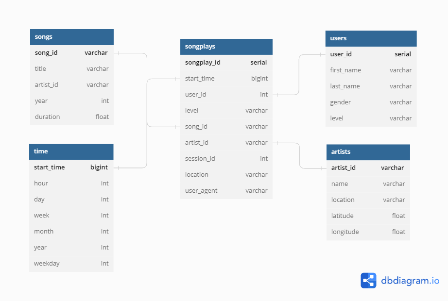

# Data Warehouse with AWS

## Introduction

A music streaming startup, Sparkify, has grown their user base and song database and want to move their processes and data onto the cloud. Their data resides in S3, in a directory of JSON logs on user activity on the app, as well as a directory with JSON metadata on the songs in their app.

They'd like a data engineer to create an ETL pipeline that extracts their data from S3, stages them in Redshift, and transforms data into a set of dimensional tables for their analytics team to continue finding insights into what songs their users are listening to.

## Project Description

In this project, we'll apply what we've learned on data warehouses and AWS to build an ETL pipeline for a database hosted on Redshift. To complete the project, we will need to load data from S3 to staging tables on Redshift and execute SQL statements that create the analytics tables from these staging tables.


## Running the Python Scripts

At the terminal:

1. ```python create_tables.py```
2. ```python etl.py```


## Database Schema

Here is the database star schema for Song Play Analysis project 


This design will offer flexibility with the queries being used for analysis.

##Project Datasets
We'll be working with two datasets that reside in S3. Here are the S3 links for each:

- Song data: ```s3://udacity-dend/song_data```
- Log data: ```s3://udacity-dend/log_data```

### Song Dataset

The first dataset is a subset of real data from the Million Song Dataset. Each file is in JSON format and contains metadata about a song and the artist of that song. The files are partitioned by the first three letters of each song's track ID. For example, here are file paths to two files in this dataset.

```
song_data/A/B/C/TRABCEI128F424C983.json
song_data/A/A/B/TRAABJL12903CDCF1A.json
```

And below is an example of what a single song file, TRAABJL12903CDCF1A.json, looks like.

```
{
    "num_songs": 1,
    "artist_id": "ARJIE2Y1187B994AB7",
    "artist_latitude": null,
    "artist_longitude": null,
    "artist_location": "",
    "artist_name": "Line Renaud",
    "song_id": "SOUPIRU12A6D4FA1E1",
    "title": "Der Kleine Dompfaff",
    "duration": 152.92036,
    "year": 0
}
```

This information is parsed to populate the Songs and Artists Dimension tables.

### Log Dataset

The second dataset consists of log files in JSON format generated by this event simulator based on the songs in the dataset above. These simulate activity logs from a music streaming app based on specified configurations.

The log files in the dataset I'll be working with are partitioned by year and month. For example, here are filepaths to two files in this dataset.

```
log_data/2018/11/2018-11-12-events.json
log_data/2018/11/2018-11-13-events.json
```


## Files Description

## test.ipynb
displays the first few rows of each table to let you check the database.

## create_tables.py

Drops and creates database tables. Run this file to reset tables before each time before running  ETL scripts.

## etl.ipynb

Reads and processes a single file from song_data and log_data and loads the data into your tables. This notebook contains detailed instructions on the ETL process for each of the tables.

## etl.py

Reads and processes files from song_data and log_data and loads them into database tables. it's the same processes as the ETL notebook.

## sql_queries.py

Contains all sql queries, and is imported into the last three files above.
